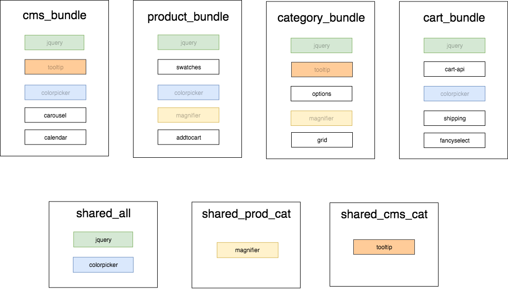

# How Does it Work?

[As previously explained](CUSTOM.md), it's not possible to bundle a Magento 2 store effectively using off-the-shelf tools, because Magento 2 heavily relies on runtime state on the server-side to decide which modules to include.

## Terminology

-   **Module**: An [AMD](https://requirejs.org/docs/whyamd.html) module
-   **RequireJS**: A [JavaScript module loader](https://requirejs.org)
-   **RequireJS Optimizer**: A [tool from the RequireJS team](https://requirejs.org/docs/optimization.html) to bundle/concatenate dependencies for production
-   **Group**: Provided through configuration. Allows grouping bundles into logical sections of a store, by URL. For example, a "product" group could be configured with URLs to different product types.
-   **Shared Bundle**: One or more JavaScript files (created by `bundlegento` automatically) that contain modules shared by > 1 group
-   **Bundle**: One or more JavaScript files (created by `bundlegento` automatically) that are a collection of > 1 module

## Steps

### Fetching

_[Source](/src/scraper.ts)_

Because static analysis cannot be relied on, `bundlegento` eschews it entirely and instead uses runtime module data it collects from different pages of a store. The pages that are crawled are specified by a user of `bundlegento` in their [configuration file](CONFIG.md).

[`Puppeteer`](https://pptr.dev/) is used to automate a headless version of [Google Chrome](https://www.google.com/chrome/). As each URL from the config is visited, a [JavaScript snippet](/src/preload.js) is injected into the page that implements the [`onResourceLoad`](https://github.com/requirejs/requirejs/wiki/internal-api:-onresourceload) handler of `RequireJS`. This code runs before any other scripts loaded by the store, and ensures that every loaded module is accounted for.

Internally, modules are stored per-group, instead of per-URL. This is because a single page does not get its own bundle - a _group_ gets a bundle.

Note that the tool does _not_ keep an actual graph of modules, but instead maintains a flat list. The graph is not necessary because we have an entire list of modules used on a page, allowing us to skip any graph traversal.

### Splitting

_[Source](/src/bundleSplitter.ts)_

With module usage data obtained during the fetching phase, modules can now be compared between groups to determine which are unique to a page, and which should be broken out to shared bundles.

The algorithm for splitting modules is fairly basic:

-   If a module exists in exactly 1 group, keep it in that group's bundle
-   If a module exists in exactly 2 groups, move it to a shared file that is loaded for any page in those 2 groups
-   If a module exists in >= 3 groups, move it to a shared bundle that will be loaded on all pages

This algorithm is illustrated in the diagram below:

_Note: A unit-test in [`bundleSplitter.test.js`](/src/__tests__/bundleSplitter.test.js) verifies the splitting algorithm matches this diagram_

In the diagram, a colored/faded module means that it has been relocated to one of the shared bundles.

The splitting completes when a `bundlegento`-specific mapping of modules to bundles has been created.

### Conversion to RequireJS Optimizer Config

TODO: Work is not done yet
